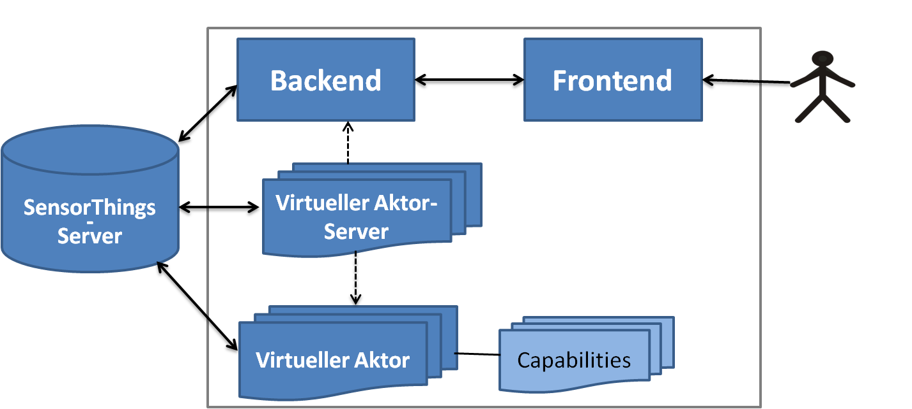

# PERMA
A project that provides a platform to create and manage (virtual) actuators on a SensorThings-Server with the Actuator Extension.

## How to build
You can built the whole system by running build-all.sh. The generated docker-images can afterwards be started using 'docker-compose up' to run the whole Application.

Alternatively, the components can be built separately. Check the readme files inside the components folders for guidance.

[Frontend](frontend/README.md)

[Backend](backend/Readme.md)

[FROST-Client](FROST-Client/Readme.md)

[Virtual Actuator (Server)](virtueller-aktor%20+%20virtueller%20Aktor-Server/README.md)

## Project structure

